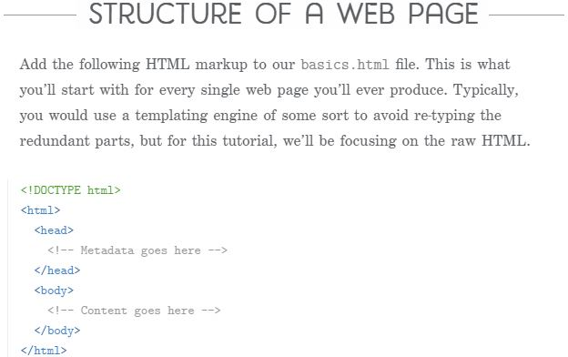

# HTML & CSS

HTML (the Hypertext Markup Language) and CSS (Cascading Style Sheets) are two of the core technologies for building Web pages. HTML provides the structure of the page, CSS the (visual and aural) layout, for a variety of devices.

****

***Wireframe***

A website wireframe, also known as a page schematic or screen blueprint, is a visual guide that represents the skeletal framework of a website. ... The wireframe depicts the page layout or arrangement of the website's content, including interface elements and navigational systems, and how they work together
***

# HTML5 # 

HTML5 is the latest version of Hypertext Markup Language, the code that describes web pages. It's actually three kinds of code: HTML, which provides the structure; Cascading Style Sheets (CSS), which take care of presentation; and JavaScript, which makes things happen.

***

***Extra Markup HTML***

Markup is what HTML tags do to the text inside of them; they mark it as a specific type of text. For example, markup text could come in the form of boldface or italicized type to draw specific attention to a word or phrase
