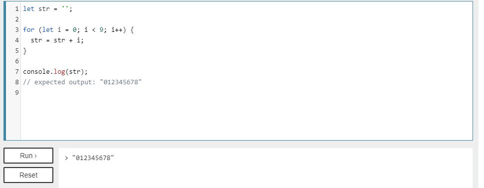
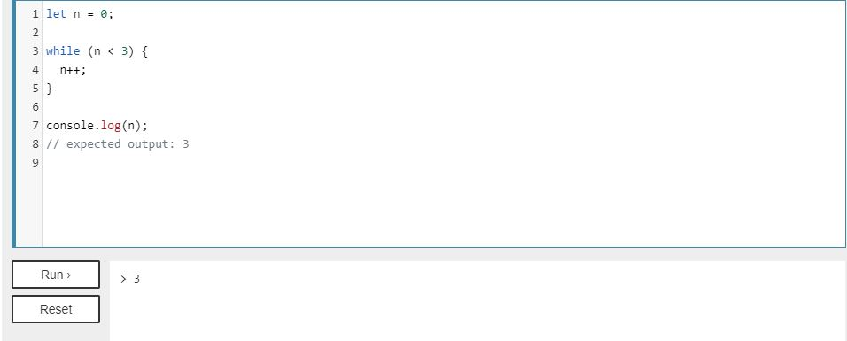

## Operators and Loops ## 
*** 

**The For** statement creates a loop that consists of three optional expressions, enclosed in parentheses and separated by semicolons, followed by a statement (usually a block statement) to be executed in the loop.

 ***Example***

 

***
 
 **The While** statement creates a loop that executes a specified statement as long as the test condition evaluates to true. The condition is evaluated before executing the statement.

***Example***

